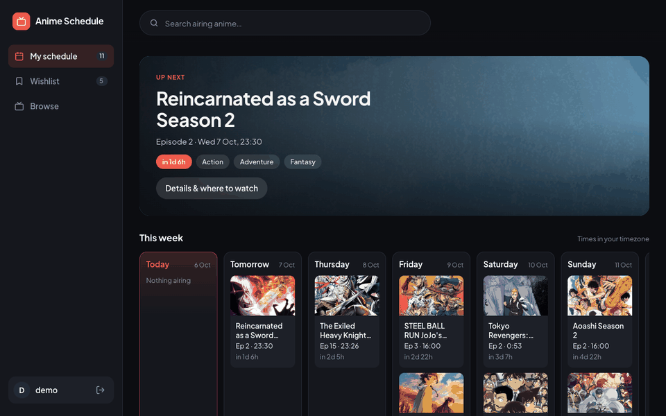

# AnimeWebApp

A weekly schedule for the anime you're watching. Add shows that are airing and see when each next episode drops, in your own timezone. Open any show to see where it's streaming. Wishlist upcoming shows and they join your schedule automatically once they start airing.

**Live:** https://anime.joshrkhoo.com · **API:** [AnimeWebAppApi](https://github.com/joshrkhoo/AnimeWebAppApi)



*Schedule → search and add a show → details and where to watch → Browse → wishlist an upcoming show → Wishlist → on a phone.*

## Features

- **Accounts.** Sign up with a username and password; each user has their own schedule and wishlist.
- **My schedule.** An "Up next" banner with a live countdown, then the 7 days starting today. Shows whose next episode is more than a week away (or not announced) appear under "Coming later".
- **Show details.** Click any show (poster, schedule card, search result or the Up next banner) to see where it's streaming, its next episode or premiere date, synopsis, genres, studio, episode count, score and a trailer link.
- **Wishlist.** Shows that haven't premiered go here and move to your schedule when they start airing (or premiere within a week), with a notification when they do.
- **Browse.** The season's most popular shows, as *Airing now* and *Upcoming* tabs.
- **Search.** Matches only shows that are airing or upcoming. The dropdown closes when you click outside it, press Esc or add a show, and has a clear button.
- **Instant feedback.** Adding a show updates the UI immediately while it saves in the background, with a toast that shows when it airs and an Undo button.
- **Works on phones.** The sidebar becomes a tab bar, days stack vertically and the details panel goes full screen.

Show data (titles, posters, air times, streaming links) comes from [AniList](https://anilist.co) through the API.

## Tech stack

| Layer          | What it uses                                                                                                                                                                  |
| -------------- | ----------------------------------------------------------------------------------------------------------------------------------------------------------------------------- |
| UI             | [React](https://react.dev) 18.3 with function components and hooks (`useState`, `useEffect`, `useMemo`, `useCallback`, `useRef`). No router or state library: views switch on component state. |
| Build          | [Create React App](https://create-react-app.dev) 5 (`react-scripts` 5.0.1: webpack 5, Babel, ESLint)                                                                          |
| Styling        | One hand-written stylesheet (`src/styles.css`): CSS custom properties for the colour theme, Grid and Flexbox layouts, and breakpoints at 900px and 640px. No CSS framework.   |
| Fonts & icons  | [Plus Jakarta Sans](https://fonts.google.com/specimen/Plus+Jakarta+Sans) from Google Fonts; icons are inline SVG components (`src/Icons.jsx`)                                   |
| Data           | Browser `fetch` to the [Flask API](https://github.com/joshrkhoo/AnimeWebAppApi), which proxies the [AniList GraphQL API](https://docs.anilist.co). `AbortController` cancels stale searches. |
| Dates & times  | Built-in `Intl` / `toLocale*String` formatting in the viewer's timezone. No date library.                                                                                     |
| Session        | Bearer token kept in `localStorage`                                                                                                                                           |
| Hosting        | [Vercel](https://vercel.com) static hosting; `anime.joshrkhoo.com` points to it with a DNS CNAME                                                                               |

The only runtime dependencies are `react` and `react-dom`.

## Project structure

```
src/
  App.jsx         App shell: session handling, sidebar, views, toasts, add/remove logic
  AuthScreen.jsx  Log in / create account
  SearchBar.jsx   Search with results dropdown
  Schedule.jsx    "Up next" banner and the weekly schedule
  Posters.jsx     Poster grid, Browse page and Wishlist page
  Details.jsx     Show details panel (streaming links, synopsis, info)
  api.js          API client and session storage
  time.js         Date formatting, week grouping, wishlist rule
  Icons.jsx       Inline SVG icons
  styles.css      All styles
docs/demo.gif     Demo GIF used in this README
```

## How it works

- **Sessions.** Logging in returns a token that's kept in `localStorage` and sent as `Authorization: Bearer <token>`. Any `401` from the API signs you out. Logging out also ends the session on the server.
- **Optimistic updates.** Adding or removing a show changes the screen immediately and then calls the API. If the call fails, the change is rolled back and an error toast appears. An Undo during a pending add waits for the add to land before removing it.
- **Schedule or wishlist.** Upcoming shows that are more than a week from airing go on the wishlist; everything else goes on the schedule. The API applies the same rule and moves wishlist shows across when they start airing.
- **Fresh data.** The library reloads every 10 minutes and whenever the tab regains focus, so air times and countdowns stay current.
- **Timezones.** All times are shown in the viewer's timezone. The week starts on the current day.

## Running locally

Start the [API](https://github.com/joshrkhoo/AnimeWebAppApi) first (it listens on port 5000 by default), then:

```bash
npm install
npm start
```

The app opens at http://localhost:3000. The API address comes from `REACT_APP_API_URL`, which Create React App reads at build time:

| File               | Used by                         | Value                                                 |
| ------------------ | ------------------------------- | ----------------------------------------------------- |
| `.env.development` | `npm start`                     | `http://127.0.0.1:5000`                               |
| `.env.production`  | `npm run build` / Vercel builds | `https://anime-web-app-api-production.up.railway.app` |

The API only accepts requests from origins listed in its `CORS_ORIGINS` setting, which includes `http://localhost:3000`.

## Deploying

The site is hosted on Vercel (project `anime-web-app`, team `joshrkhoo1`) and isn't connected to GitHub, so deploy from this folder:

```bash
vercel deploy --prod --scope joshrkhoo1
```

`vercel.json` sets the build command to `CI=false react-scripts build`. Otherwise Vercel's CI mode would fail the build on lint warnings.

The custom domain `anime.joshrkhoo.com` is a CNAME to `cname.vercel-dns.com`, managed in Squarespace DNS.
